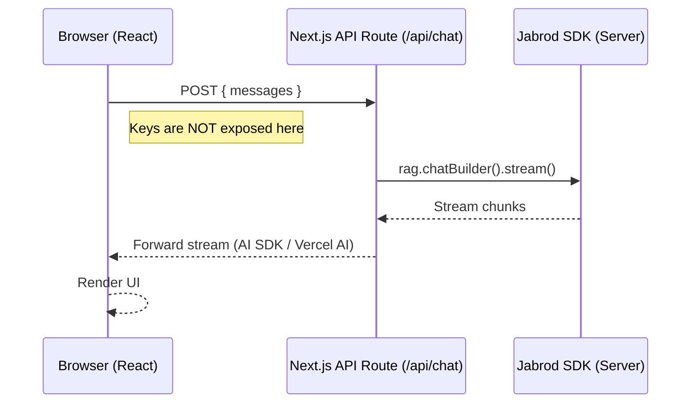

# Next.js Full Stack App

This example demonstrates the "Production Stack": Next.js 14 App Router, TypeScript, Tailwind CSS, and Jabrod SDK running on the server side.

## Architecture

To protect your API keys, the Jabrod SDK runs in Next.js API Routes (Serverless Functions), not in the client browser.



## SDK Implementation

### 1. Server-Side Client

We initialize the client in a safe server-side file.

```typescript
// lib/jabrod.ts
import { JabrodClient } from 'jabrod';

// Singleton pattern allows reuse across reloads in dev
export const jabrod = new JabrodClient({
  apiKey: process.env.JABROD_API_KEY
});
```

### 2. API Route Handler

In `app/api/chat/route.ts`, we handle the POST request.

```typescript
import { jabrod } from '@/lib/jabrod';
import { NextResponse } from 'next/server';

export async function POST(req: Request) {
  const { messages } = await req.json();
  const lastMessage = messages[messages.length - 1];

  const stream = await jabrod.rag.chatBuilder()
    .withInput(lastMessage.content)
    .withKB('production-kb')
    .stream();

  // Return raw stream to client
  return new Response(stream);
}
```

### 3. Frontend

The frontend stays lightweight, just rendering the stream.

<CardGroup cols={1}>
  <Card title="View on GitHub" icon="github" href="https://github.com/jabrod/examples/tree/main/test.jabrod/ex4-nextjs-chat">
    See the full Next.js stack in ex4-nextjs-chat
  </Card>
</CardGroup>
