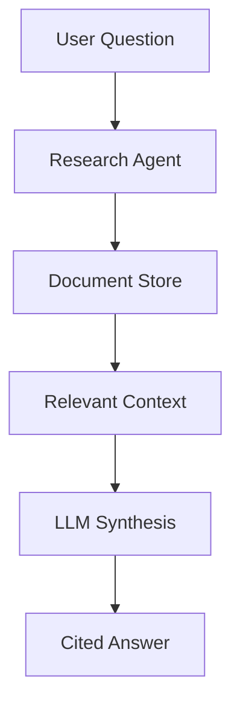

# Research Agent

The Research Agent shows how to build "Agentic RAG" - a system that doesn't just retrieve text, but reads multiple documents to synthesize a comprehensive answer.

## Architecture

This flow involves a **Context Window Management** strategy where the Agent decides which parts of the documents are relevant.



## SDK Implementation

### 1. Multi-Document Context

The Research Agent allows uploading multiple PDF/Text files into a single session.

```javascript
// Upload multiple files to the same KB
for (const file of files) {
    await client.kb.upload({
        kbName: 'research-session-123',
        file: file
    });
}
```

### 2. Synthesizing the Answer

We use a sophisticated system prompt to force the model to act as a researcher.

```javascript
const research = await client.rag.chatBuilder()
    .withKB('research-session-123')
    .withSystemPrompt(`
        You are a Research Assistant.
        1. Read the provided context carefully.
        2. Synthesize an answer to the user's question.
        3. CITE your sources using [Doc Name] format.
        4. If documents disagree, note the conflict.
    `)
    .withInput(query)
    .withModel('mistral-large') // Using a larger model for reasoning
    .execute();
```

## Key Concept: Source Attribution

By instructing the model via the `systemPrompt` to cite sources found in the RAG context, we turn a generic answer into a verifiable research summary.

<CardGroup cols={1}>
  <Card title="View on GitHub" icon="github" href="https://github.com/jabrod/examples/tree/main/test.jabrod/ex3-research-agent">
    Explore the Research Agent code in ex3-research-agent
  </Card>
</CardGroup>
