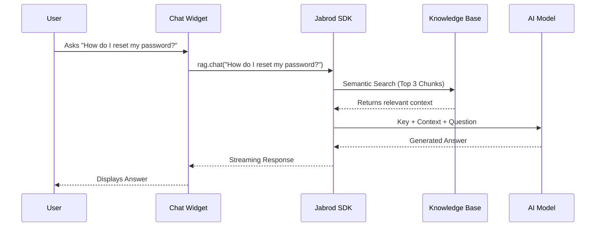

# AI Support Chatbot

This example demonstrates how to build a production-grade customer support widget that can answer questions based on your own knowledge base (FAQ, documentation, etc.) using Retrieval-Augmented Generation (RAG).


## Architecture

The application follows a simple client-server flow (or direct client-SDK in this demo) where user questions are processed through Jabrod's RAG pipeline.



## SDK Implementation

This example relies on three key Jabrod SDK features: **Knowledge Bases**, **Chat Builder**, and **Streaming**.

### 1. Creating the Knowledge Base

First, we ingest the FAQ data. The SDK handles chunking and embedding automatically.

```javascript
// Check if KB exists, if not create it
let kb = await client.kb.get('support-faq-v1');

if (!kb) {
    kb = await client.kb.create({
        name: 'support-faq-v1',
        description: 'Customer support FAQs and policies'
    });
    
    // Upload the FAQ text file directly
    await kb.upload(fileObj);
}
```

### 2. The Chat Loop

We use the `chatBuilder` pattern to construct a conversational pipeline. This allows us to inject system prompts and bind the knowledge base.

```javascript
const response = await client.rag.chatBuilder()
    .withInput(userMessage)
    .withKB('support-faq-v1') // Bind the KB we created
    .withSystemPrompt(`
        You are a helpful support agent for Acme Corp.
        Use the provided context to answer questions.
        If you don't know, say "please contact human support".
    `)
    .stream(); // Enable streaming response
```

### 3. Handling the Stream

The SDK returns an async iterator that yields chunks of the response as they are generated, providing a snappy user experience.

```javascript
for await (const chunk of response) {
    appendToChatUI(chunk.content);
}
```

## View Source Code

The complete source code is available on GitHub. It includes the HTML/CSS for the chat widget and the full JavaScript logic.

<CardGroup cols={1}>
  <Card title="View on GitHub" icon="github" href="https://github.com/jabrod/examples/tree/main/test.jabrod/ex1-support-bot">
    Check out the full implementation of ex1-support-bot
  </Card>
</CardGroup>
